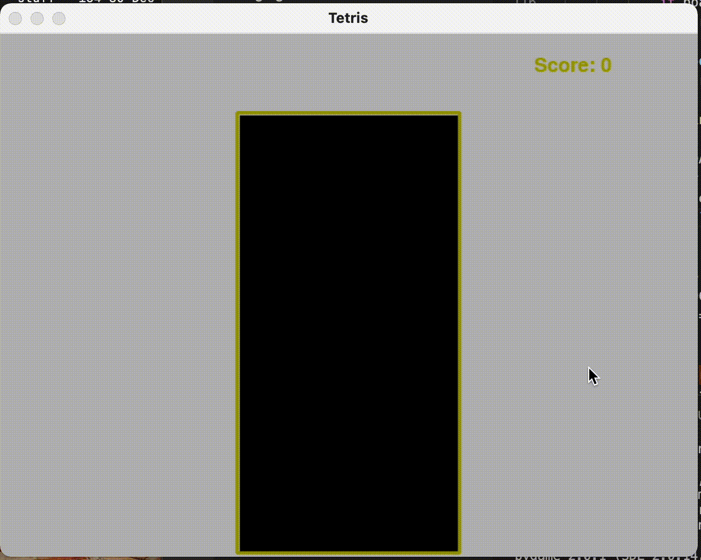

# Pytris

Simple multi-step learning tutorial for family learning programming over the xmas break in 2020. Inspired and adapted by [Invent With Python](https://inventwithpython.com/pygame/chapter7.html).



## Setup

Install Python and then pygam as follows

```bash
python3 -m pip install -U pygame --user
```

## Running

Each step can be run separately and comments are in the *-start file for what code to add in each step. 

You can also select the start/end files in VS Code and compare them to see the changes between them.